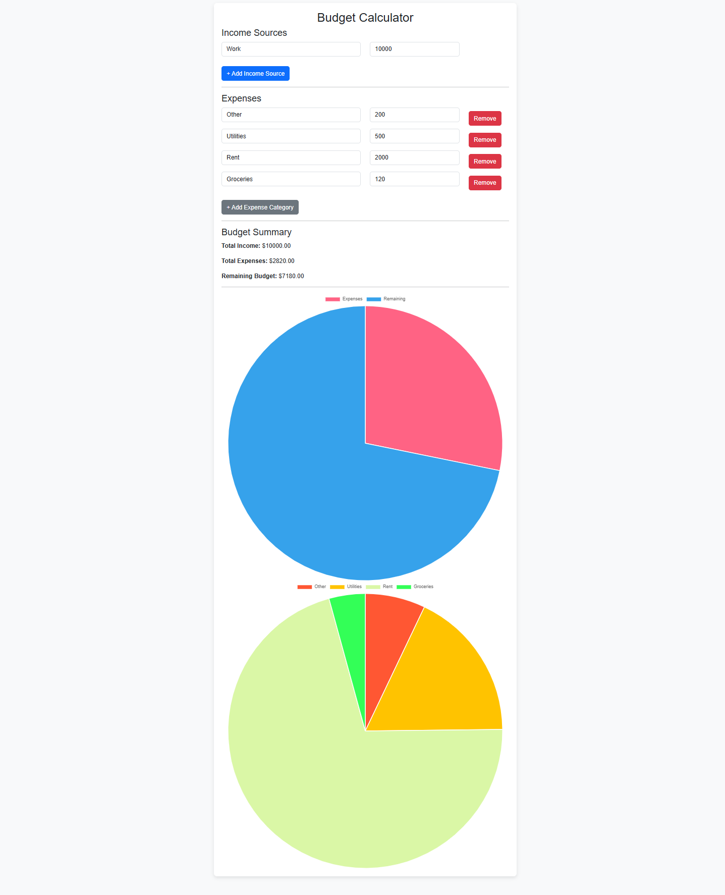

# Budget-Calculator
Project Overview

The Budget Calculator is a web application designed to help users manage their personal finances by calculating their income, expenses, and remaining budget. It allows users to input income sources and expenses, dynamically update their budget summary, and visualize data with interactive charts. The application has been built using **HTML, JavaScript, and CSS** with a focus on usability and interactivity.

## Live Demo
[Click here to view the live project](https://jmansour2.github.io/Budget-Calculator/)

## Features
- Add, edit, and delete expenses dynamically
- Visualize spending with interactive graphs
- Responsive design for mobile and desktop

## How to Use
1. Clone the repository: `git clone https://github.com/jmansour2/Budget-Calculator.git`
2. Open `index.html` in your browser.

## Technologies Used
- HTML
- CSS
- JavaScript
**Core Features**
Income Section
Dynamic Income Inputs: Users can input multiple sources of income, each with a source name and amount. This data is added to a running total of income, which automatically updates when new entries are made.
Add More Sources: A button to add more income sources dynamically, which includes fields for entering a source name and amount.

Expense Section
Expense Categories: A dropdown menu allows users to select expense categories (e.g., Rent, Utilities, Groceries, etc.). The application disables previously selected categories to prevent duplication, providing an interactive experience.
Custom Expense Categories: Users can also type in custom expense categories if "Other" is selected from the dropdown.
Dynamic Expense Entries: Expenses can be added and removed dynamically. Users can input the amount for each expense category, and the total expenses are updated accordingly.

**Budget Summary**
Total Income and Expenses: The application calculates the total income and total expenses in real-time.
Remaining Budget: The remaining budget is displayed by subtracting total expenses from total income.
Warning Message: If expenses exceed income, a warning message is displayed.

**Data Visualizations**
Pie Charts: The application uses Chart.js to render pie charts that visualize:
Expenses vs Remaining Budget
Breakdown of expenses by category
The charts update automatically when income or expenses are modified.

**User Experience**T[he Budget Calculator](url) is designed to provide real-time updates as users enter income or expense data. The dynamic nature of the application ensures users can see changes immediately, which helps keep them engaged and aware of their financial situation.

**Interactions and Engagement**
Interactive Dropdowns: The dropdown menu for expense categories blurs out already selected categories, ensuring users only pick unique categories. This adds a layer of interactivity and helps prevent mistakes.
Smooth UI Movement: Throughout the app, smooth transitions and movements have been added using JavaScript to keep users engaged. For example, newly added rows (income/expense) smoothly appear on the screen.
Future Additions

**Here are some planned future features for the Budget Calculator:**

**Save and Load Data:** Allow users to save their data to a backend (using PHP and MySQL) so they can return to the app later and continue from where they left off.
User Authentication: Introduce a login feature for personal budget tracking, allowing users to create accounts, store their budget data securely, and access it across devices.

**Currency Conversion:** Enable users to select their preferred currency, with real-time exchange rates to convert amounts between different currencies.
Recurring Expenses/Income: Allow users to set recurring income or expenses, such as monthly salaries or subscriptions, which would automatically populate in the next period.

**Export Options:** Provide users the option to export their budget data as a PDF or Excel file for offline use.
Known Bugs

**Negative Values Issue:** A known bug exists where entering two negative values results in a positive total. This issue occurs due to a logic oversight when calculating the budget. The issue will be fixed in the upcoming commit, where negative values will be handled correctly.

**Initial Dropdown Issue:** When the first expense row is added, the dropdown does not blur out the categories already selected, although it works fine for subsequent rows. This issue is being addressed in the next update.
Occasionally, the dropdown menu does not immediately update when a new row is added, leaving some categories enabled that should be disabled. This issue can occur when a user quickly adds multiple rows. A fix will be added to better handle the initial row selections.
